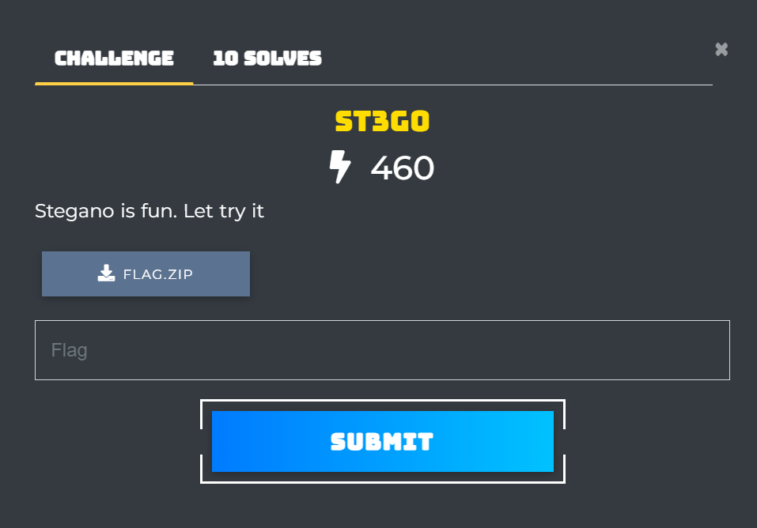
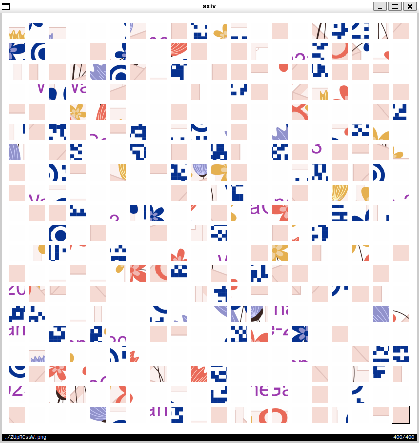
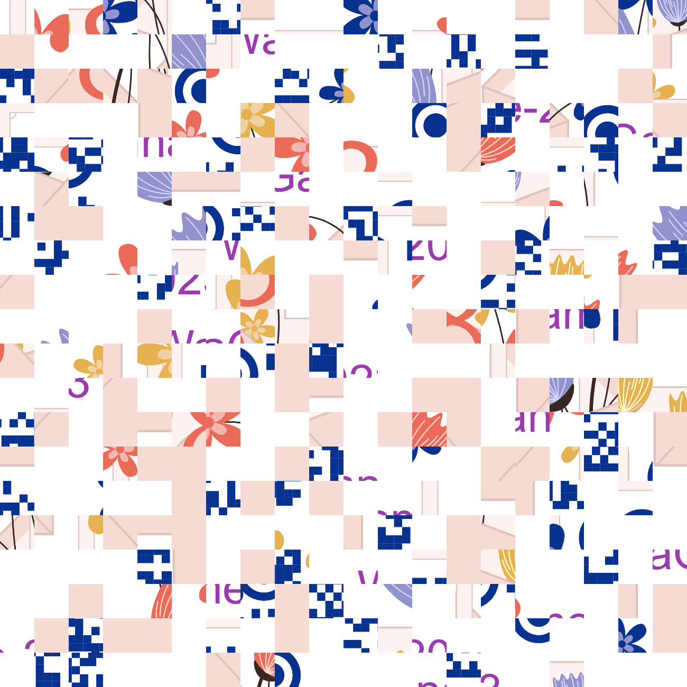

# St3g0



First let's try to extract [flag.zip](./flag.zip)

```sh
❯ unzip flag.zip
Archive:  flag.zip
   skipping: flag/0cvy5d8y.png       unsupported compression method 99
   skipping: flag/08itwpKE.png       unsupported compression method 99
   skipping: flag/0DAUp9L1.png       unsupported compression method 99
```

[A quick google search](https://access.redhat.com/solutions/59700) tell us that:
  - unzip doesn't support AES encryption
  - 7zip package can be used to extract password protected zip files

Time to crack the zip password using the famous [rockyou wordlist](https://www.kaggle.com/datasets/wjburns/common-password-list-rockyoutxt)

```sh
yay -S p7zip wordlists john
```

```sh
❯ zip2john flag.zip > hash.txt
flag.zip/flag/ is not encrypted!
[1]    717744 segmentation fault  zip2john flag.zip > hash.txt
```

Apparently this was [an upstream issue in 2020](https://github.com/openwall/john/issues/4232) and latest stable of john from 2019 just doesn't cut it, let's try again:

```
yay -S john-git
```

```
❯ zip2john flag.zip > hash.txt
ver 2.0 flag.zip/flag/ is not encrypted, or stored with non-handled compression type
❯ john hash.txt --wordlist=/usr/share/wordlists/seclists/
Passwords/Leaked-Databases/rockyou.txt
Warning: detected hash type "ZIP", but the string is also recognized as "ZIP-opencl"
Use the "--format=ZIP-opencl" option to force loading these as that type instead
Using default input encoding: UTF-8
Loaded 400 password hashes with 400 different salts (ZIP, WinZip [PBKDF2-SHA1 128/128 AVX 4x])
Cracked 39 password hashes (are in /home/nullchilly/.john/john.pot), use "--show"
Remaining 361 password hashes with 361 different salts
Remaining hashes with cost 1 (HMAC size) varying from 84 to 6129
Will run 16 OpenMP threads
Press 'q' or Ctrl-C to abort, 'h' for help, almost any other key for status
daydreamer       (flag.zip/flag/t3UCCayn.png)
daydreamer       (flag.zip/flag/gHTdJ6xc.png)
daydreamer       (flag.zip/flag/Yi53MEfX.png)
```

That's much better :)

```sh
❯ 7z x flag.zip -pdaydreamer

7-Zip [64] 17.05 : Copyright (c) 1999-2021 Igor Pavlov : 2017-08-28
p7zip Version 17.05 (locale=en_US.UTF-8,Utf16=on,HugeFiles=on,64 bits,16 CPUs x64)

Scanning the drive for archives:
1 file, 377517 bytes (369 KiB)

Extracting archive: flag.zip
--
Path = flag.zip
Type = zip
Physical Size = 377517

Everything is Ok

Folders: 1
Files: 400
Size:       363827
Compressed: 377517
```

Running `sxiv flag` we can see that it's a 20x20 jigsaw puzzle:



A well known jigsaw puzzle solver seems to be [gaps](https://github.com/nemanja-m/gaps/)

It seems like sxiv's gallery gap doesn't help us here, we'll need to write our own [merge.py](./merge.py)



Plugging into gaps:

```sh
gaps run merged_image.png solution.png --size=65 --generations=100
gaps run solution.png solution.png --size=65
gaps run solution.png solution.png --size=65
gaps run solution.png solution.png --size=65
```

Insanity is doing the same thing over and over again but it works for genetic algorithm :)


Scanning the QR code link us to https://pastebin.com/Z383nUtc

Of course, the pastebin is password protected..

We need to search for additional data in flag/

```sh
❯ pngcheck flag/*
OK: flag/08itwpKE.png (65x65, 24-bit RGB, non-interlaced, 79.1%).
flag/0cvy5d8y.png  additional data after IEND chunk
ERROR: flag/0cvy5d8y.png
OK: flag/0DAUp9L1.png (65x65, 24-bit RGB, non-interlaced, 93.3%).
OK: flag/0mDrBHY9.png (65x65, 24-bit RGB, non-interlaced, 98.2%).
```

The password was hidden after the IEND chunk

```sh
❯ cat flag/0cvy5d8y.png
[[truncated]]IEND�B`�WannaGame
```

Unlock the pastebin using `WannaGame`

```sh
❯ pastebin get Z383nUtc -pWannaGame
W1{St3g_1s_Fun_b3f8a74d5e21c69ef20d0874e9c36a9c}
```