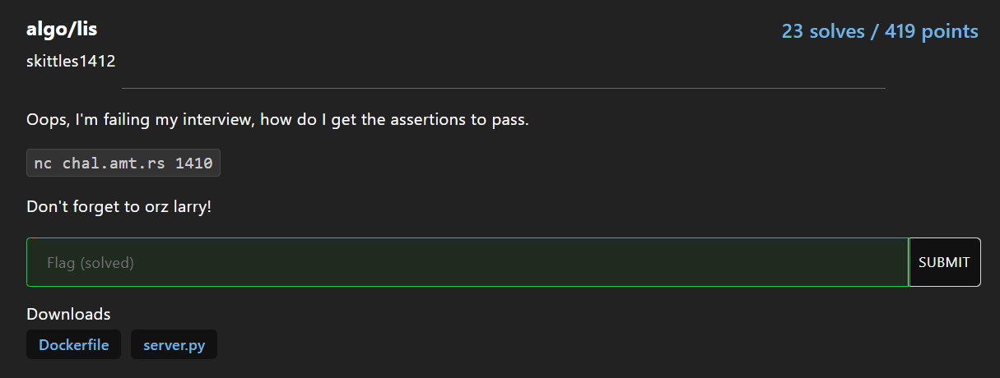

# Problem

Given an array a of length n `(n <= 1e5)`, find indexes of the Longest increasing subsequence

### Input

```
3
14 3 13 4 12 7 9 10 4 7 2 1
1 4 1 5 1 6 7 1
1 2 1 3 1 4 5 2 63 29 1
```

### Output

```
-1 1 3 5 6 7
0 1 3 5 6
-11 -10 -8 -6 -5 -2 8
```

# Solution

Notice that negative index is also valid in python!

```py
def check_output(arr, ans):
    ans.sort()
    for i in range(len(ans) - 1):
        assert arr[ans[i]] < arr[ans[i + 1]]
```

Simply find `LIS` of `a + a` and output `LIS -= len(a)`

```py
from pwn import *

nc = remote('chal.amt.rs', 1410)

# Modified https://github.com/cheran-senthil/PyRival/blob/master/pyrival/misc/lis.py to return index instead of value
def lis(nums, cmp=lambda x, y: x < y):
    P = [0] * len(nums)
    M = [0] * (len(nums) + 1)
    L = 0

    for i in range(len(nums)):
        lo, hi = 1, L

        while lo <= hi:
            mid = (lo + hi) // 2
            if cmp(nums[M[mid]], nums[i]):
                lo = mid + 1
            else:
                hi = mid - 1

        newL = lo
        P[i] = M[newL - 1]
        M[newL] = i

        L = max(L, newL)

    S = [0] * L
    k = M[L]

    for i in range(L - 1, -1, -1):
        S[i], k = k, P[k]

    return S

t = int(nc.recvline().decode())
arrs = [list(map(int, nc.recvline().split())) for _ in range(t)]
for a in arrs:
    # negative index is also valid
    ans = [x - len(a) for x in lis(a + a)]

    nc.sendline((' '.join(map(str, ans))).encode())
nc.interactive()
```

```sh
> python solve.py
[+] Opening connection to chal.amt.rs on port 1410: Done
[*] Switching to interactive mode
Good job! Remember to orz larry. Here's your flag amateursCTF{orz-larry-how-is-larry-so-orz-ac3596ad5cba22151e721e205fb5b3120dd6910dc9b42af88ae52dfdfd073333}
```