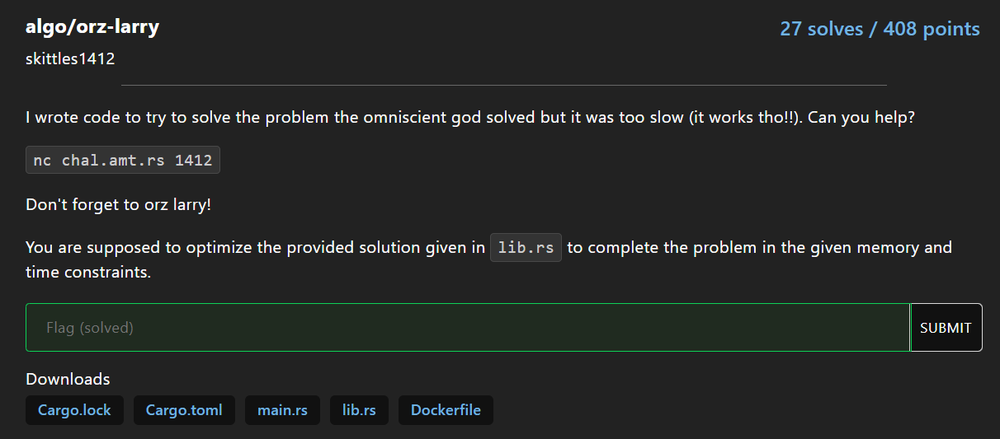

# Problem

Given a string s of length n `(n <= 1e5)`, count number of distinct subsequence mod `1e9 + 9`

### Input

```
3
abc
aba
aaa
```

### Output

```
8
7
4
```

# Solution

Output [940. Distinct Subsequences II](https://leetcode.com/problems/distinct-subsequences-ii/editorial/) + 1

```py
from pwn import *

nc = remote('chal.amt.rs', 1412)

MOD = 10**9 + 9

t = int(nc.recvline().decode())
arrs = [nc.recvline().strip().decode() for _ in range(t)]

for s in arrs:
    dp = [1]
    last = {}
    for i, x in enumerate(s):
        dp.append(dp[-1] * 2)
        if x in last:
            dp[-1] -= dp[last[x]]
        last[x] = i

    nc.sendline(str(dp[-1] % MOD).encode())
nc.interactive()
```

```sh
> python solve.py
[+] Opening connection to chal.amt.rs on port 1412: Done
[*] Switching to interactive mode
Yay! Good job, here's your flag and remember to orz larry: amateursCTF{orz-larry-how-is-larry-so-orz-4efe27a2edde418184d668992819a62fa4b3a7e6ba5ac3a204be9a66ed7b7105}
```